# 나만의 프롬프트 관리 프로그램

GenAI를 활용하며 쌓인 프롬프트들을 카테고리별로 저장하고, 검색하고,
즐겨찾기로 관리할 수 있는 터미널 기반 콘솔 프로그램입니다.

Python 기초 문법(변수, 조건문, 반복문, 함수, 리스트/딕셔너리)과
Git 버전 관리(커밋, 브랜치, 병합, GitHub 연동)를 익히기 위한
실습 미션으로 제작되었습니다.

## 실행 방법

이 프로젝트는 외부 라이브러리 없이 Python 기본 문법만 사용합니다.

```bash
python3 --version   # Python 3.10 이상 필요
python3 main.py
```

프로그램을 실행하면 메뉴가 표시되고, 번호를 입력해 원하는 기능을
선택할 수 있습니다. 프로그램 실행 중에 추가한 프롬프트와 즐겨찾기
상태는 프로그램을 종료하면 초기화됩니다 (메모리에만 저장).

## 기능 목록

| 번호 | 기능 | 설명 |
| --- | --- | --- |
| 1 | 프롬프트 추가 | 제목/내용/카테고리를 입력해 새 프롬프트를 등록합니다 |
| 2 | 프롬프트 목록 | 저장된 모든 프롬프트를 번호와 함께 보여줍니다 |
| 3 | 카테고리별 조회 | 선택한 카테고리에 속한 프롬프트만 보여줍니다 |
| 4 | 프롬프트 검색 | 제목/내용에 포함된 키워드로 검색합니다 |
| 5 | 프롬프트 상세 보기 | 번호를 입력해 프롬프트 전체 내용을 확인합니다 |
| 6 | 즐겨찾기 관리 | 번호를 입력해 즐겨찾기를 추가/해제합니다 |
| 7 | 즐겨찾기 목록 | 즐겨찾기한 프롬프트만 모아서 보여줍니다 |
| 0 | 종료 | 프로그램을 종료합니다 |

## 프롬프트 카테고리

- 텍스트 생성
- 이미지 생성
- 영상 생성
- 페르소나
- 자동화
- 기타

새 프롬프트를 추가할 때 위 카테고리 중 하나를 선택하거나, 목록에
없는 카테고리를 직접 입력할 수도 있습니다.

## 코드 구조

기능별로 함수를 분리해 작성했습니다.

- `get_default_prompts()` — 기본 프롬프트 데이터 생성
- `show_menu()` — 메뉴 출력
- `input_nonempty()` — 빈 값 재입력 처리
- `choose_category()` — 카테고리 선택/입력
- `add_prompt()` — 프롬프트 추가
- `show_list()` — 전체 목록 출력 (별도 브랜치 `feature/list-view`에서 작업 후 병합)
- `show_by_category()` — 카테고리별 조회
- `search_prompt()` — 키워드 검색
- `show_detail()` — 상세 보기
- `manage_favorite()` — 즐겨찾기 토글
- `show_favorites()` — 즐겨찾기 목록
- `main()` — 메뉴 루프

## Git 명령어 사용 기록

이 프로젝트를 진행하며 실제로 사용한 Git 명령어와, 각각을 어떤 목적으로 썼는지 정리합니다.

| 명령어 | 언제 / 왜 사용했나 |
| --- | --- |
| `git init` | 새 로컬 저장소를 실제로 초기화하는 과정을 익히기 위해, 별도의 연습용 폴더(`git-init-demo`)를 만들어 `git init` → `git add` → `git commit`까지 직접 수행해봤습니다 (스크린샷 참고, 확인 후 폴더 삭제). 이번 과제의 본 저장소(`codyssey_youjin`)는 이전 미션(B1-3 등)에서부터 이어서 사용 중인 저장소라 `git clone`으로 받아와 작업을 이어갔습니다. |
| `git config --global user.name / user.email / init.defaultBranch` | 개발 환경을 준비하며 Git 커밋에 기록될 작성자 정보(이름, 이메일)와 새 저장소의 기본 브랜치 이름(`main`)을 전역 설정으로 등록했습니다. |
| `git clone` | (1) 이 프로젝트 저장소 자체를 로컬 컴퓨터로 받아올 때, (2) Git 학습 목적으로 공개 샘플 저장소(`octocat/Hello-World`)를 별도로 clone해서 폴더 구조와 `git log`를 확인해봤습니다 (확인 후 삭제). |
| `git add` | 기능을 하나씩 완성할 때마다 변경된 파일을 스테이징 영역에 올릴 때 사용했습니다. |
| `git commit` | `add_prompt()`, `search_prompt()`, `manage_favorite()` 등 기능 단위로 커밋 메시지를 남기며 스냅샷을 저장했습니다. (총 10개 이상의 기능 단위 커밋) |
| `git branch` / `git checkout -b feature/list-view` | "프롬프트 목록" 기능(`show_list()`)을 `main`과 분리된 `feature/list-view` 브랜치에서 작업하기 위해 브랜치를 만들고 전환했습니다. |
| `git checkout main` + `git merge feature/list-view` | `feature/list-view` 브랜치에서 기능 구현을 마친 뒤 `main` 브랜치로 돌아와 병합했습니다. (`git log --oneline --graph` 스크린샷에서 병합 지점 확인 가능) |
| `git push` | 로컬에서 만든 커밋들을 GitHub 원격 저장소에 업로드할 때마다 사용했습니다. |
| `git pull` | 다른 세션/기기에서 작업을 이어갈 때 원격 저장소의 최신 상태를 로컬에 반영하기 위해 사용했습니다 (실행 시 "Already up to date" 확인). |

## 스크린샷

### 개발 환경

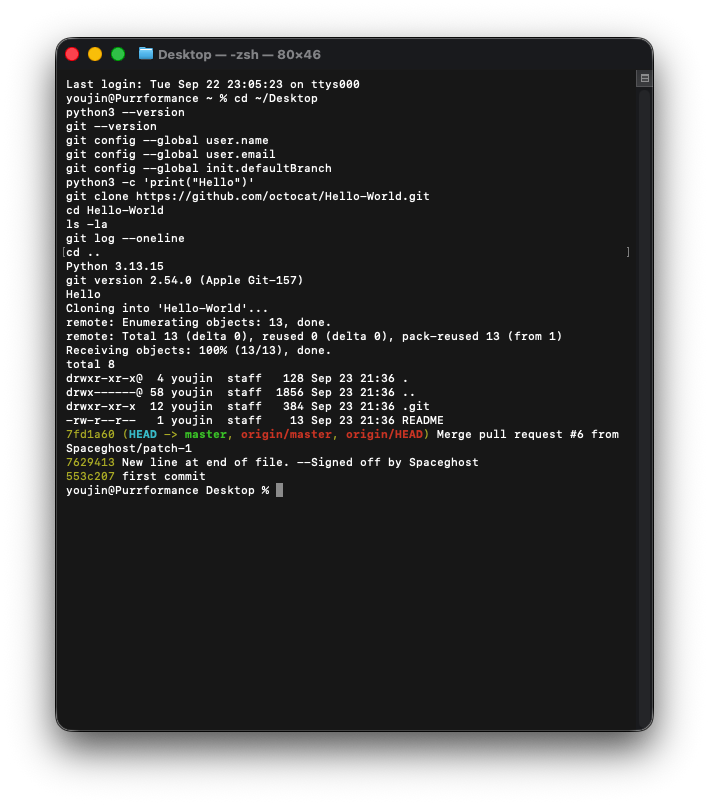
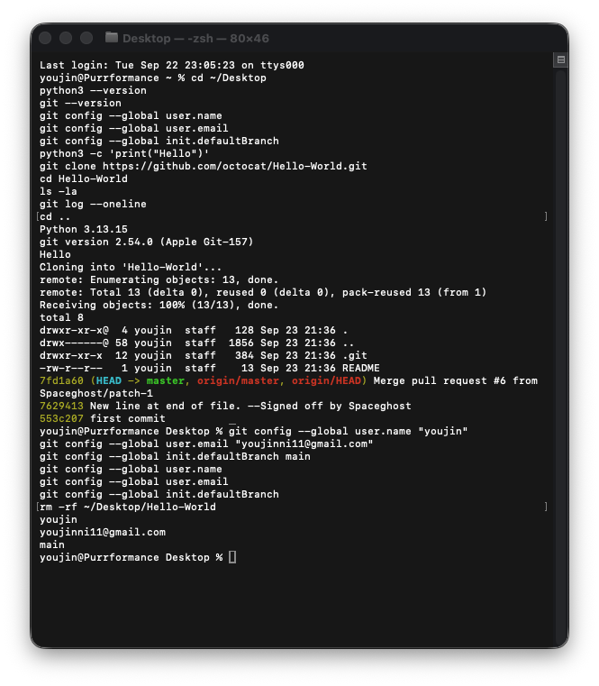
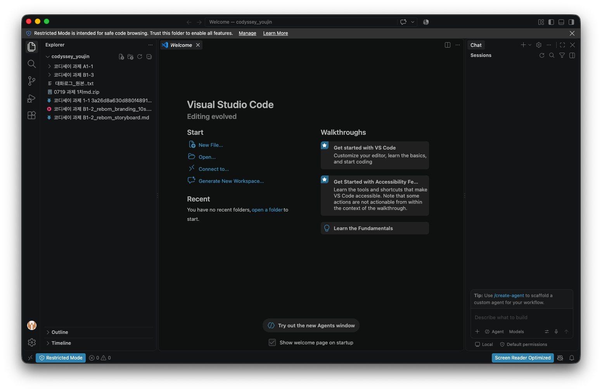
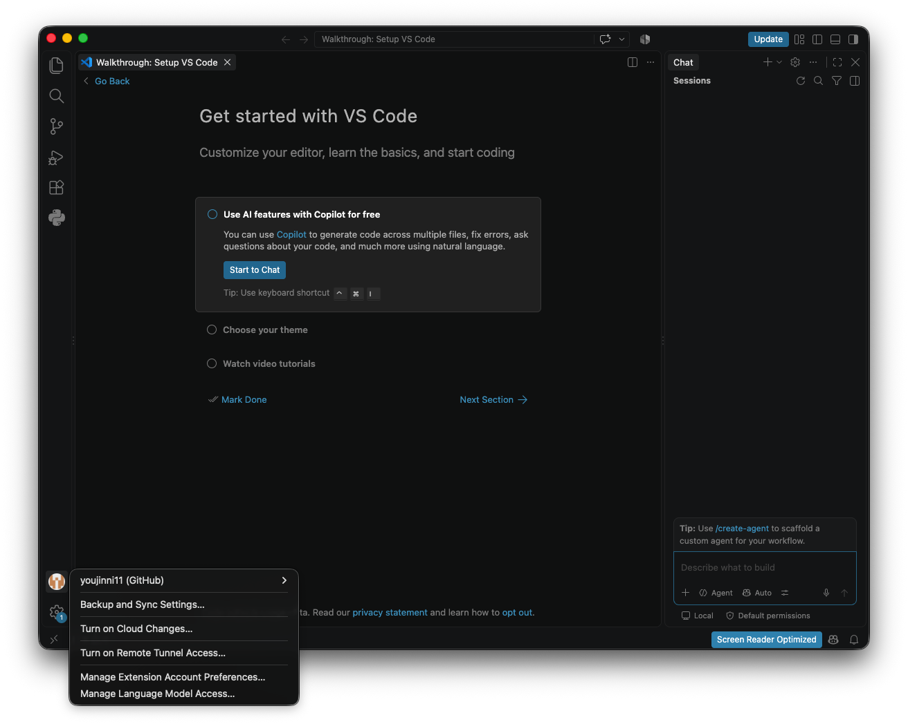
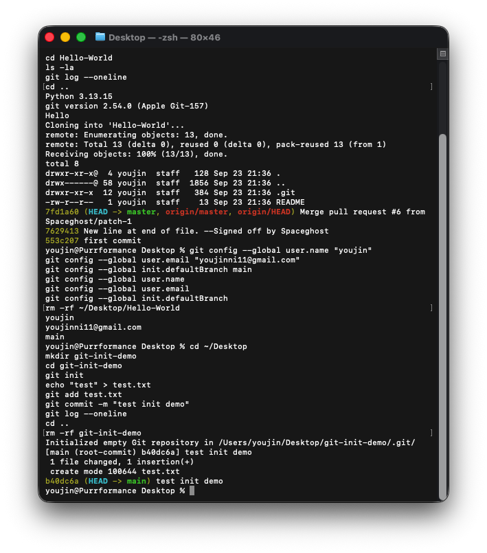

### 프로그램 실행

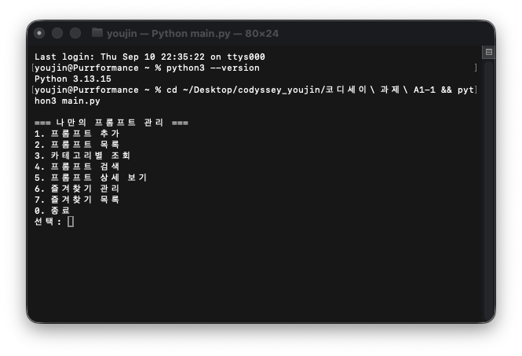
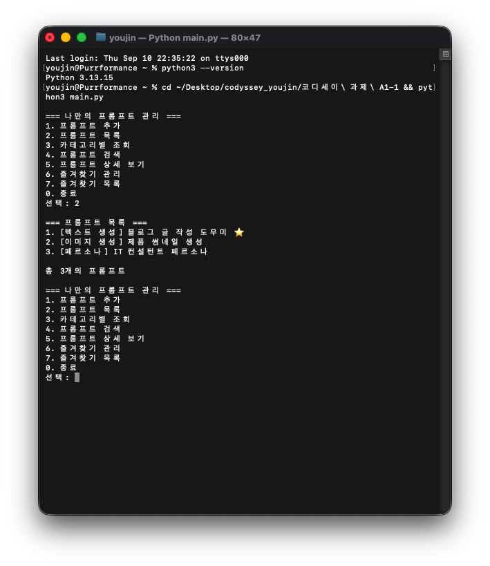
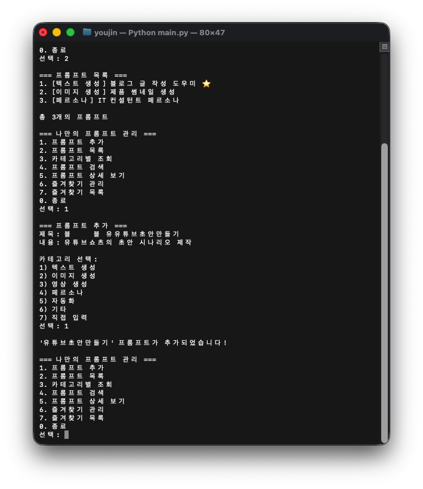
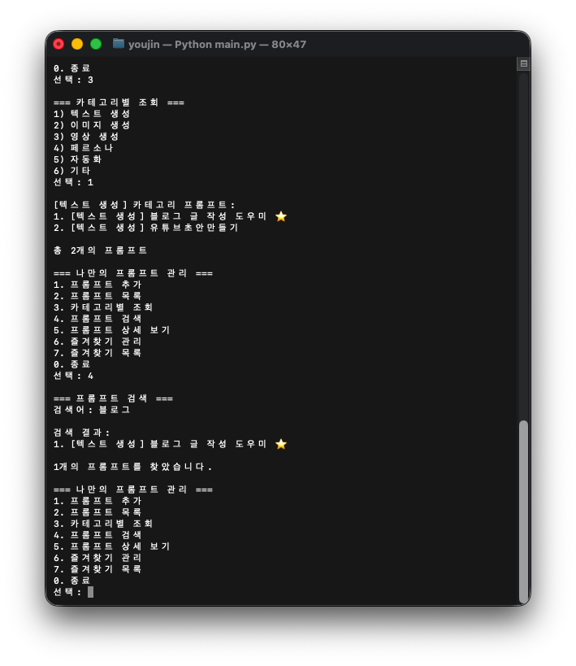
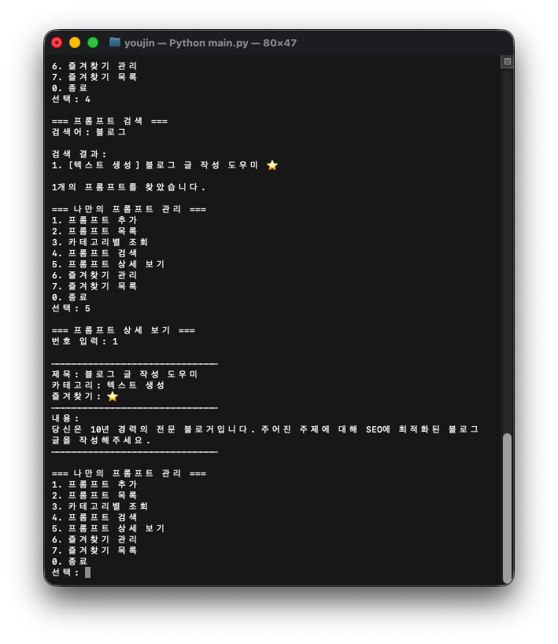
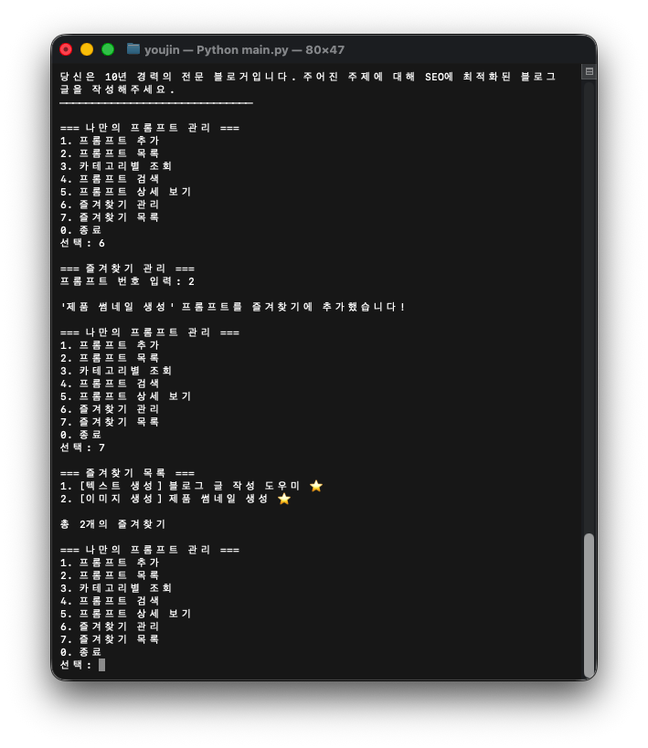

### 커밋 히스토리 (브랜치 병합 포함)

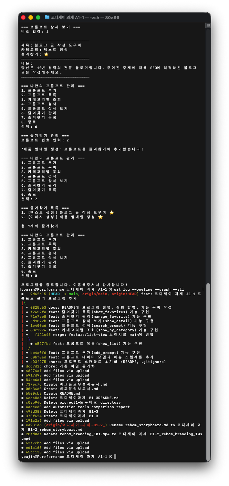
